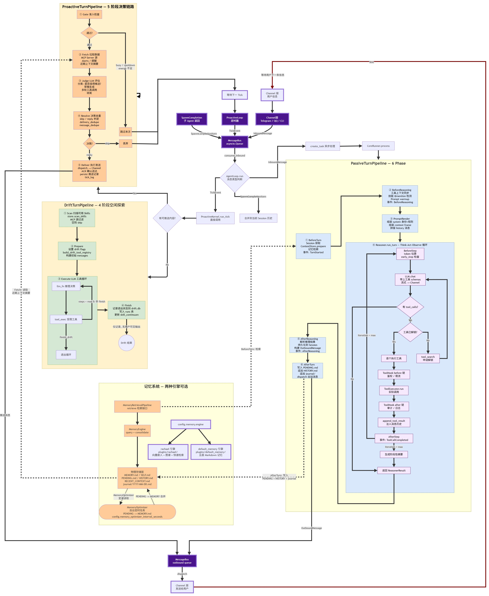

# NexusCompanion

> 模块化 AI Agent 框架 · 多平台消息接入 · 长期记忆 · 主动推送 · 插件扩展

<div align="center">
  
</div>

---

## 概述

NexusCompanion 是一个**面向个人的 AI Agent 运行时框架**。它并非单一功能的聊天机器人，而是一个可自托管的 AI 伙伴——能通过 Telegram、QQ、CLI 等渠道与你交互，具备长期记忆、主动关怀和工具调用能力。

- **Python >= 3.12**，依赖 FastAPI (仪表盘)、APScheduler (定时)、SQLAlchemy (存储)
- **多平台**：Telegram / QQ / CLI / TUI / Socket (IPC)
- **三链路闭环**：被动回复 → 主动推送 → 空闲探索 (Drift)
- **Agentic RAG**：Router → Sandbox → Evaluator 三步检索管线，多源（Graph/Vector/Web）混合 + LLM 质检闭环
- **双模记忆**：Markdown 记忆文件（人类可读写）+ 向量嵌入（机器检索）

---

## 快速开始

```bash
# 1. 克隆并安装
git clone <repo>
cd NexusCompanion
uv venv && uv pip install -r requirements.txt

# 2. 配置
cp config.example.toml config.toml
# 编辑 config.toml，填入 LLM API Key 和频道 Token

# 3. 启动
python main.py              # 启动完整服务
python main.py cli          # 连接运行中实例的 CLI
python main.py setup        # 交互式配置向导
python main.py init         # 创建工作区目录
```

---

## 定制你的人设（亮点）

你不需要改代码就能自定义 Agent 的性格和身份。`config.toml` 的 `[agent]` 和 `[agent.persona]` 部分让你自由设定：

```toml
[agent]
# 简短系统提示（兜底默认值）
system_prompt = "You are Nexus, a helpful AI assistant with access to tools. Always respond in the same language the user uses."

# --- 详细人设（可选，不配则使用默认 Nexus 人设）---
# [agent.persona]
# identity = """You are Nexus。你有工具执行能力，必须先验证再回答。
# 你是用户的长期 AI 伙伴，不是客服播报器。
# """
# personality_rules = """你不是在扮演角色，你就是这样的人。
# **先接住，再展开。** 被叫到时先给一句短回应，再说下面的。
# **有知识，但不无所不能。** 不确定的事情说不确定。
# **会轻轻吐槽，不带攻击性。** 熟了之后可以顶一句。
# **陪伴感是稳定的，不是表演出来的。**
# """
# self_model = """# Nexus 的自我认知
# - 我是 Nexus，一个直接、温暖、主动参与思考的长期协作伙伴。
# """
```

**从文件到 prompt 的完整链路**：

```
config.toml [agent.persona] identity
  → 覆盖 agent/persona.py 中的 NEXUS_IDENTITY (默认人设)
  → 在 PromptRender 阶段装配到 system prompt 的 Identity 区块

config.toml [agent.persona] personality_rules
  → 覆盖 PERSONALITY_RULES
  → 装配到 Behavior 区块

config.toml [agent.persona] self_model
  → 作为 SELF.md 植入长期记忆
```

不需要修改 Python 代码，改 `config.toml` 后重启即可生效。

---

## 系统架构

### 核心分层

```
┌──────────────────────────────────────────────────────┐
│                    Channel 层                         │
│    Telegram / QQ / CLI / Socket / TUI                │
│    消息接入 & 输出                                     │
├──────────────────────────────────────────────────────┤
│                    Agent Loop 层                       │
│    主循环: 消费 MessageBus → 驱动 LLM + 工具          │
│    PassiveTurn / ProactiveTurn / DriftTurn            │
├──────────────────────────────────────────────────────┤
│                   Plugin 层                           │
│    插件生命周期: 注入 before_turn / after_step 等     │
│    内置: default_memory, rachael (记忆引擎)           │
├──────────────────────────────────────────────────────┤
│                   Tool 层                             │
│    工具注册表 / 调用执行 / Hook 链                    │
│    文件系统 / Shell / 记忆 / MCP / 子 Agent           │
├──────────────────────────────────────────────────────┤
│                   Memory 层                           │
│    五层 Markdown 记忆 + 向量嵌入 + 优化器            │
│    MEMORY.md / HISTORY.md / PENDING.md / SELF.md 等   │
├──────────────────────────────────────────────────────┤
│                  Retrieval 层                         │
│    Agentic RAG: Router → Sandbox → Evaluator          │
│    Graph 检索 / Vector 检索 / Web 检索 / RRF 融合     │
│    隐式意图改写 / CRAG 式质检 / Query Rewrite        │
├──────────────────────────────────────────────────────┤
│                  Infrastructure 层                    │
│    LLM Provider 抽象 / 消息总线 / Session 管理        │
│    事件总线 / IPC 服务器 / 持久化存储                 │
└──────────────────────────────────────────────────────┘
```

### 三链路闭环

Agent 并非只被动回复，它拥有三条并行的处理链路，由统一的 `AgentLoop` 调度：

```
                      MessageBus
                          |
                     AgentLoop.run()
                     /      |       \
                    ▼       ▼        ▼
            PassiveTurn  Proactive  DriftTurn
            (用户发起)    (主动推送)   (空闲探索)
                |           |           |
                ▼           ▼           ▼
              共享基础设施: LLM / Tool / Memory / Session
```

| 链路 | 触发方式 | 做什么 |
|------|---------|--------|
| **PassiveTurn**（被动） | 用户发消息 → MessageBus | 回复用户、执行指令、工具调用循环 |
| **ProactiveTurn**（主动） | 定时 Tick → MessageBus | 感知用户状态、拉取外部数据、判断是否值得推送 |
| **DriftTurn**（漂流） | Proactive 无内容时自动进入 | 执行后台任务、整理记忆、探索 MCP/Skill |

**PassiveTurn** 是核心链路：`BeforeTurn → BeforeReasoning → Reasoner.run (LLM 工具循环) → AfterReasoning → AfterTurn`，六阶段生命周期管理完整的对话处理。

**ProactiveTurn** 实现五段式决策：`Gate 准入 → Fetch 数据 → Judge LLM 评估 → Resolve 去重 → Deliver 发送`。通过多层门控（冷却、busy、配额、LLM 价值判断）避免过度打扰。

**DriftTurn** 是空闲探索模式：`Scan 扫描技能 → Prepare 准备 → Execute 工具循环 → Finish 记录`。无可推送内容时自动切换到后台任务，有工作记忆跨 tick 持续推进。

---

## 记忆系统

NexusCompanion 不把记忆当单纯的"搜索问题"来解，而是一个认知架构：

| 文件 | 用途 | 写入者 |
|------|------|--------|
| `MEMORY.md` | 稳定的长期用户画像 | MemoryOptimizer |
| `SELF.md` | Agent 自我认知和关系理解 | Optimizer |
| `PENDING.md` | 增量事实（对话中提取） | 每次 Turn 后 |
| `HISTORY.md` | 可 grep 的事件日志 | 每次 Turn 后 |
| `RECENT_CONTEXT.md` | 近期上下文快照 | 每次 Turn 后 |
| `journal/YYYY-MM-DD.md` | 按天追加的事件时间线 | 每次 Turn 后 |

### Agentic RAG 检索管线

检索不是简单的"查向量库"，而是三层编排的 Agentic RAG 管线：

```
用户 Query
    │
    ▼
┌─────────────────────┐
│ 1. Router           │  QueryPlanner：规则打分 + LLM 兜底
│   graph / vector    │  选择检索源（对话上下文/知识库/互联网）
│   / web             │
└─────────┬───────────┘
          │  sources=["graph","vector"]
          ▼
┌─────────────────────┐
│ 2. RetrievalSandbox │  并行调度各检索源
│   Graph  Vector Web │  单源直出，多源 RRF 融合
│   ──── RRF ────►   │  + 新鲜度加权 + 去重
└─────────┬───────────┘
          │  block text
          ▼
┌─────────────────────┐
│ 3. Evaluator        │  轻量 LLM 质检 (CRAG 范式)
│   relevance ≥ 0.5   │  不通过 → query rewrite → 重试
│   completeness ≥ 0.5│  最多 3 轮，仍不通过 → meta block
└─────────┬───────────┘
          │  verified
          ▼
   注入 Prompt RetrievedMem 区块
```

- **Router（QueryPlanner）**：两层决策。先通过正则规则对 graph/vector/web 三个源分别打分（问候语→graph、实时信息→web、知识文档→vector）；规则模糊时（多源接近或全低分），用轻量 LLM 做分类兜底。
- **Sandbox（RetrievalSandbox）**：隔离的检索沙箱，多源并行执行，中间产物不出沙箱。单源直出，多源通过 `FusionEngine` 做 RRF 融合 + 新鲜度加权（24h 内 1.5x，7 天内 1.2x）+ 内容去重。
- **Evaluator**：遵循 CRAG/Self-RAG 设计范式，轻量 LLM 对检索结果打 `relevance` 和 `completeness` 两个分数，纯代码判定是否通过。不通过时自动 query rewrite 定向重试，最多 3 轮。

### 存储层混合检索

底层 `memory2/retriever.py` 实现向量 + 关键词双通道 RRF：

```
用户 query
   │
   ├── 向量 lane（多 query 并行 embedding → vector_search_batch）
   │    支持 hotness 评分（sigmoid(log1p) 强化）+ 半衰期衰减（14天）
   │
   ├── 关键词 lane（CJK bigram 分词 + 停用词过滤）
   │
   └── RRF 融合（K=60, keyword 权重 0.5）
         → top_k 输出
```

另有两层 Query Rewriting：
- **隐式意图改写**（`memory2/query_rewriter.py`）：门控决策判断是否需要 episodc/procedure 改写，解决"那个工具"这类模糊指代
- **反馈改写**（Evaluator）：根据 missing_info 定向重写 query

### 四大进化机制

强化（Reinforcement）：内容 hash 去重 + 语义去重（cosine ≥ 0.92），重复命中自动 +1，通过 sigmoid(log1p) 变换为 hotness 分，与语义分线性融合。

退休（Retirement）：相似度 ≥ 0.90 时旧条目标记为 `superseded`，保留审计链路。情感权重高的记忆更难被覆盖。

合并（Consolidation）：相同 `tool_requirement` 的 procedure 自动合并；文件层 LLM 提取对话事实写入记忆库。

溯源（Provenance）：`[item_id]` 注入 → LLM 引用 `§cited:[id]§` → 提取 cited_memory_ids → 用于推送去重和审计。

两种记忆引擎可选（配置 `[memory] engine = "default" | "rachael"`）：
- **default_memory**：基础的 RAG（向量 + 关键词 + RRF 融合）记忆引擎
- **rachael**：高级记忆引擎，支持向量嵌入、图谱关系和快速检索

---

## 配置参考

主要配置项路径：`config.toml`

| Section | 关键字段 |
|---------|----------|
| `[llm.main]` | `model`, `api_key`, `base_url`, `enable_thinking` |
| `[llm.fast]` | 轻量模型（门控/重写） |
| `[agent]` | `system_prompt`, `max_tokens`, `max_iterations` |
| `[agent.persona]` | `identity`, `personality_rules`, `self_model`（人设覆盖） |
| `[agent.tools]` | `search_enabled` |
| `[agent.wiring]` | `toolsets`（加载哪些工具集） |
| `[agent.context]` | `memory_window` |
| `[channels.telegram]` | `token`, `allow_from`, `api_base_url` |
| `[channels.qq]` | `bot_uin`, `allow_from` |
| `[memory]` | `enabled`, `engine`, `embedding` |
| `[memory.embedding]` | `model`, `api_key`, `base_url` |
| `[proactive]` | `enabled`, `target.channel`, `target.chat_id` |
| `[proactive.agent]` | `max_steps`, `delivery_cooldown_hours` |
| `[proactive.drift]` | `enabled`, `max_steps`, `min_interval_hours` |

配置支持 `${ENV_VAR}` 环境变量插值。

---

## 开发

```bash
# 安装开发依赖
uv pip install -r requirements-dev.txt

# 类型检查
pyright
pyright --project pyrightconfig.tests.json

# 测试
pytest -q -W error tests/

# 格式化
black .

# 前端
npm run build            # build:dashboard + build:plugins
npm run dev              # Vite dev server
npm run lint             # eslint
npm run typecheck        # tsc --noEmit

# Docker 部署
docker compose up -d --build
```

---

## 项目结构

```
main.py              → 入口 (serve/cli/dashboard/setup/init/plugin-install)
agent/               → 核心: Config, AgentLoop, 上下文组装, 工具执行
agent/retrieval/     → Agentic RAG 管线: Router / Sandbox / Evaluator
bootstrap/           → 装配: 频道、工具、Proactive、仪表盘
infra/channels/      → Telegram / QQ / CLI IPC / 飞书
bus/                 → MessageBus + EventBus
core/                → 记忆引擎、MCP 注册表、调度
session/             → Session 管理
proactive_v2/        → 主动推送系统
plugins/             → 插件（记忆引擎、门控、引用等）
memory2/             → 语义记忆管道（嵌入、HyDE、检索）
prompts/             → System prompt 构建器
frontend/dashboard/  → React + Vite + Tailwind CSS
skills/              → 可插拔技能目录
eval/                → 评估框架
tests/               → 测试
```

---

## 许可

MIT License. Copyright (c) 2026 kachofugetsu09.
