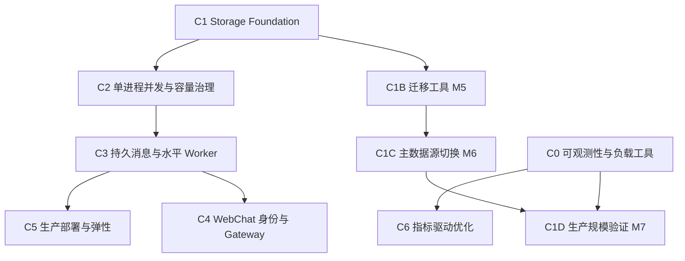

# Scaling Roadmap

> **定位**：本文件是 program-level tracker，跟踪整个 Scaling Program 的 North Star、可度量目标、
> capability map、依赖、当前 focus、阻塞项与 exit evidence。**不承载** implementation task、
> 逐 commit 记录或手动完成 checkbox，**不作为**当前系统行为的规范 source of truth。
> 当前规格以 `openspec/specs` 为准；当前 change 状态以 `openspec/changes` 与 `openspec status` 为准；
> 实现事实以代码、测试和 benchmark 证据为准。
> 内容来源：`SCALING_PLAN-2026-08-22.md` 冻结快照的分类迁移（迁移矩阵见 change
> `establish-scaling-openspec-baseline` 的 tasks.md）。
> 上次审阅：2026-08-22（日期只表示 last reviewed，不作为完成依据）。

## 1. North Star

NexusCompanion 从单机单用户扩展到可服务 **5000 注册租户/身份**的规模化 AI 伙伴：以 PostgreSQL 为主数据源承载会话、记忆与交付状态；多租户隔离由服务端可信身份派生；单进程内并发有界、不阻塞 event loop；可横向扩展 Worker 与 Gateway。同时保留 SQLite 单用户开发路径、可回滚的迁移状态机与可复现的验收证据。

## 2. "5000 users" 目标维度

"5000 用户"不是一个可直接压测的指标，必须按下表拆分，每个维度可度量：

| 维度                         | 定义                                               | 暂定口径                                 |
| -------------------------- | ------------------------------------------------ | ------------------------------------ |
| registered tenants         | 可在系统中拥有独立数据的 principal/tenant 数                  | 5000                                 |
| concurrent online sessions | 同时维持的 WebSocket 连接数                              | 画像 A 接近 0（channel-only）；画像 B 上限 5000 |
| active turns               | 同时等待 LLM、工具或存储的 turn 数                           | 由 LLM 配额反推，不等于在线人数                   |
| ingress rate               | 每秒进入系统的新消息数                                      | 持续值与突发值分别定义（Phase 0 确认）              |
| LLM concurrency            | 每 provider/model 的并发与 RPM/TPM/预算                 | 由容量与成本模型计算，不静态拍板                     |
| data volume                | session messages、memory items、attachments 总量与增长率 | 按真实样本推算，不只算 embedding 原始字节           |

## 3. 验收画像与 SLO

验收画像除 5000 注册身份外，额外要求最高 5000 条 WebSocket 同时在线（只增加 Gateway 容量，不代表同时执行 5000 个 LLM turn）。

服务目标（数值可在 Phase 0 基线后调整，但不得删除维度）：

| 指标      | 目标                                                              |
| ------- | --------------------------------------------------------------- |
| 入站接收    | 已鉴权消息 P95 250 ms 内 accepted/queued                              |
| 排队延迟    | 设计负载内 P95 queue wait ≤ 2 s；超载明确 busy/retry-after                |
| 首帧延迟    | P95 ≤ 上游模型首 token 延迟 + 1 s                                      |
| 最终消息可靠性 | 已持久化完成的回复不静默丢失，失败进重试或 DLQ                                       |
| 会话顺序    | 同 session 的 turn 按确定顺序执行，无历史覆盖或 seq 冲突                          |
| 隔离      | 所有读写/搜索/附件访问由服务端派生 tenant/principal 范围                          |
| 可恢复性    | PostgreSQL RPO ≤ 5 min、RTO ≤ 30 min（按部署方案确认）                    |
| 可观测性    | 任一 turn 可经 `turn_id` 串起 ingress、queue、worker、LLM、store、delivery |

## 4. Capability map

| Capability                           | outcome                                                                    | dependency                | active OpenSpec change                                                                            | status   | exit evidence                                                                                                                               |
| ------------------------------------ | -------------------------------------------------------------------------- | ------------------------- | ------------------------------------------------------------------------------------------------- | -------- | ------------------------------------------------------------------------------------------------------------------------------------------- |
| GOV 治理与文档基线                          | OpenSpec / Roadmap / 代码·测试·证据三类事实来源生效，SCALING_PLAN 退役                      | —                         | `establish-scaling-openspec-baseline`（已 archive `2026-08-23-establish-scaling-openspec-baseline`） | verified | merge commit `e50732d6`；`openspec validate` 通过；`openspec/specs/scaling-governance`（12 requirements）已 sync                                   |
| C1 Storage Foundation（PG + pgvector） | SQLite/PG 双 adapter、tenant 贯穿、pool + bounded executor、provisioning 控制面     | —                         | 已完成（merge `0a83314d`）                                                                             | verified | merge commit `0a83314d`；5000 tenant provisioning 基准 `evidence/phase1-storage/results/m4h4_partition_provisioning.json`；tenant isolation 测试  |
| C1B 迁移工具（M5）                         | 批量 COPY、断点续传、机器可读校验                                                        | C1                        | `phase1b-migration-cutover`（planning 完成，待 apply）                      | planned  | 导入/校验结果入库                                                                                                                                   |
| C1C 主数据源切换（M6）                       | S0-S4 状态机切 PostgreSQL primary                                              | C1B                       | `phase1b-migration-cutover`（planning 完成，待 apply）                                                  | planned  | staging cutover、PITR/回滚演练                                                                                                                   |
| C1D 生产规模验证（M7）                       | 真实 1024 维 embedding、5000 并发用户、autovacuum/REINDEX、PITR                      | C1C                       | 计划（未创建）                                                                                           | planned  | 生产硬件基准                                                                                                                                      |
| C0 可观测性与负载工具                         | turn_id 全链路追踪、指标导出、可重复负载工具                                                 | —                         | `c0-observability-load`（已 archive `2026-08-23-c0-observability-load`）                             | verified | merge commit `a777ded2`；全量验证 `evidence/c0/full-verification.md`（pytest 1060 passed，pyright 基线一致）；`openspec/specs/observability-load` 已 sync |
| C2 单进程并发与容量治理                        | TurnAdmission + ModelGateway：同 session 串行、有界 inflight、限流预算                 | C1（store interface 稳定）    | 计划（未创建）                                                                                           | planned  | 吞吐随 `max_inflight_turns` 增长到瓶颈而非 single-flight                                                                                              |
| C3 持久消息与水平 Worker                    | ingress queue + inbox 去重 + transactional outbox + delivery DLQ + 多副本 lease | C2                        | 计划（未创建）                                                                                           | planned  | 多 Worker 幂等/恢复测试；DLQ/backlog 可观测                                                                                                            |
| C4 WebChat 身份与 Gateway               | 服务端身份派生、鉴权端点、5000 WS 连接                                                    | C3（final delivery + auth） | 计划（未创建）                                                                                           | proposed | 越权矩阵全 403/404；5000 WS 压测                                                                                                                    |
| C5 生产部署与弹性                           | 单实例 → 多 Worker → 多 Gateway → 容器编排                                          | C3                        | 计划（未创建）                                                                                           | planned  | N+1 故障下 SLO；runbook 演练                                                                                                                      |
| C6 指标驱动优化                            | 仅指标证明必要时启用 Redis cache / read replica 等                                    | C0                        | 计划（未创建）                                                                                           | planned  | 瓶颈/基线/收益/回滚记录                                                                                                                               |

> 状态仅代表 program-level 跟踪。`verified` 必须满足 §8 完成状态规则；未开始的 capability 以
> `planned`/`proposed` 标记，不提前创建永久 active change。

## 5. 当前阶段、focus、blocker、next decision

- **当前阶段**：GOV 治理与文档基线已 verified（merge `e50732d6`）；C1 Storage Foundation 已 verified（merge `0a83314d`）；C0 可观测性与负载工具已 verified（merge `a777ded2`，change `c0-observability-load` 已 archive）；Phase 1B change `phase1b-migration-cutover`（C1B+C1C）planning 完成，待 apply。
- **current focus**：Phase 1B（C1B 迁移工具 + C1C 主数据源切换）——OpenSpec change 已创建（`openspec/changes/phase1b-migration-cutover/`，4/4 artifacts complete）；apply 在独立 branch/worktree 执行，任务状态与证据由 OpenSpec changes/specs 承载。
- **current blocker**：无 hard blocker。C1B/C1C 的 OpenSpec change 已创建，apply 时需建立独立 branch/worktree；C1D 生产基准需生产硬件与真实数据分布。
- **next decision**：开始 Phase 1B apply（建立 `feature/phase1b-migration` worktree 并按 change tasks 推进）；C1C 边界内 turn control plane 归属已定案为 dual-store（见 change design.md D6）；C0 change `c0-observability-load` 已 archive 并 merge main（`a777ded2`），capability 已标 `verified`。

## 6. Capability dependency graph

## 7. 状态定义

| 状态          | 含义                                                        |
| ----------- | --------------------------------------------------------- |
| planned     | 已规划但尚未进入正式设计或实施                                           |
| proposed    | 已提出设计方向，未创建/未开始 OpenSpec change                           |
| in_progress | 有活跃 OpenSpec change 正在设计、实施或 apply                        |
| blocked     | 依赖未满足或存在阻塞项                                               |
| verified    | 满足 §8 完成状态规则（有 merge/test/benchmark 证据，关联 change 已完成生命周期） |
| retired     | 已退役，不再作为当前目标或能力                                           |

## 8. 完成状态规则

- 只有 **merge commit、可复现测试或 benchmark 证据**存在时，才能使用 `verified`。
- OpenSpec change **未完成、未 sync、未 archive** 时，不得把 capability 标为 `verified`。
- **日期只能表示 last reviewed**，不得作为完成依据。
- Roadmap 不承载 implementation task 与逐 commit 历史；任务与进度由 OpenSpec change 的 tasks 与 `openspec status` 承载。
