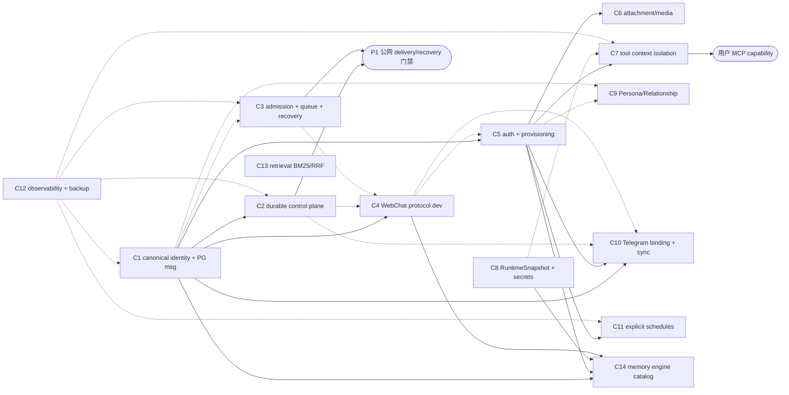

# Pilot 任务依赖图（DAG）

> 依赖图依据 `PILOT_ROADMAP.md §5.9.10`「Change 拆分与开工顺序」与 §6 分阶段路线。任务编号 `C1..C14` 对应 `task-01..task-14`，跨文档稳定。
> 状态规则（planned/in_progress/verified/blocked/deferred）复用 §8；本图只表达依赖，不表达完成状态。

## 1. 节点定义（14 + 2 派生节点）

| 节点 | 对应文件 | 名称 | 所属阶段 |
| --- | --- | --- | --- |
| `C1` | `task-01-canonical-identity.md` | canonical identity + PG conversation/message 基础 | P-1 → P0 → P0.5 |
| `C2` | `task-02-durable-control-plane.md` | durable ingress/inbox + turn/work + outbox/delivery | P0.5（P1 收口） |
| `C3` | `task-03-admission-queue-recovery.md` | tenant admission + bounded queue + restart recovery | P0（P3 演练收尾） |
| `C4` | `task-04-webchat-protocol-dev-loop.md` | WebChat protocol + dev-only channel/Gateway/frontend | P0.5 |
| `C5` | `task-05-auth-provisioning-admin.md` | invitation auth + provisioning/readiness + admin/browser security | P1 |
| `C6` | `task-06-attachment-media.md` | authenticated attachment/media lifecycle | P1（P3 演练收尾） |
| `C7` | `task-07-tool-context-isolation.md` | tenant tool context/resource/effect isolation | P0.5 接缝 → P1 → P2 |
| `C8` | `task-08-runtimesnapshot-secrets.md` | RuntimeSnapshot lease + hook failure + tenant secret/revocation | P0 audit → P2 收尾 |
| `C9` | `task-09-persona-relationship.md` | Persona/Relationship tenant storage + optimizer concurrency | P1 |
| `C10` | `task-10-telegram-binding-sync.md` | Telegram binding + cross-channel synchronization | P1 |
| `C11` | `task-11-explicit-schedules.md` | tenant-owned explicit schedules + recovery | P2（P3 演练收尾） |
| `C12` | `task-12-observability-backup.md` | observability/privacy/redaction + backup manifest | P-1 契约 → P0 → P3（贯穿） |
| `C13` | `task-13-memory-retrieval-bm25.md` | memory retrieval BM25/hotness/RRF + 离线评测 | P0（独立质量基线） |
| `C14` | `task-14-memory-engine-catalog.md` | memory engine plugin catalog/binding + WebChat selector | P1 |
| `P1GATE` | —（派生节点，非 change） | P1 公网 delivery/recovery 门禁 = C2 ∧ C3 | P1 前置检查点 |
| `UMCP` | —（派生节点，非 change） | 用户 MCP capability（§5.9.7 后续独立 capability） | P2 后置 |

## 2. §5.9.10 规范依赖边（canonical，强制，D1–D7）

直接转译 §5.9.10 段末原文：

| 编号 | §5.9.10 原文片段 | 有向边 |
| --- | --- | --- |
| D1 | 「1 是 2、4、5、10 的前置」 | `C1 → C2`、`C1 → C4`、`C1 → C5`、`C1 → C10` |
| D2 | 「2 和 3 是公网 delivery/recovery 承诺的前置」 | `C2 → P1GATE`、`C3 → P1GATE` |
| D3 | 「5 是 6、7、10、11 对普通 tenant 开放的前置」 | `C5 → C6`、`C5 → C7`、`C5 → C10`、`C5 → C11` |
| D4 | 「7 是用户 MCP 的前置」 | `C7 → UMCP` |
| D5 | 「12 可以先定义契约并伴随各 change 落地」 | `C12 ⇢ C1..C11,C13,C14`（虚线贯穿：先契约，后伴随落地） |
| D6 | 「13 是独立质量能力，不阻塞 4、5」 | `C13 ∥ C4`、`C13 ∥ C5`（无依赖边，可与 C4/C5 并行） |
| D7 | 「14 依赖 tenant identity、WebChat auth、RuntimeSnapshot 和 tenant plugin catalog，但不要求先完成 BM25/ParadeDB/jieba/reranker migration」 | `C1 → C14`、`C5 → C14`、`C8 → C14`、`C4 → C14`（WebChat 前端承载 selector）；`C13 ↛ C14` |

## 3. 派生边（derived，来自 §6 阶段实现要求，E1–E10）

派生边不改变 §5.9.10 规范顺序，仅补齐阶段实现层面的耦合，实现时须遵守：

| 编号 | 派生边 | 理由（§引用） |
| --- | --- | --- |
| E1 | `C2 → C4` | §6 P0.5：dev WebChat 闭环需 C2 的 durable inbox/outbox（「接通 durable ingress/inbox、canonical conversation/message stream 和 outbox/delivery record」） |
| E2 | `C3 → C4` | §6 P0.5 运行于 P0 基线之上；tenant-scoped admission + 有界队列 + overload 是 dev WebChat 闭环前置 |
| E3 | `C4 → C5` | §6 P1：公网 WebChat = C4 通道/adapter + C5 认证；认证基于已有 WebChat channel |
| E4 | `C8 → C7` | §5.9.7/§5.9.16：TenantToolCatalog 由 `TenantRuntimePlan` 解析；C7 工具隔离消费 C8 的 per-task context seam |
| E5 | `C5 → C9` | §6 P1：「用户首次登录时进入一次性人设设置流程」；Persona tenant 存储需 auth principal |
| E6 | `C1 → C9` | Persona tenant 存储需 tenant 派生（经 C5 传递亦可，显式标注避免遗漏） |
| E7 | `C2 → C10` | §5.6 同步验收：跨端同步需 durable inbox + canonical message stream |
| E8 | `C4 → C10` | §5.6：Telegram 新消息实时推送到 WebChat 需 WebChat 前端/协议 |
| E9 | `C1 → C3` **（弱边）** | §5.9.5 admission key = tenant_id；C3 在 P0 可先用现有 `tenant_id_for_channel()`，C1 落地后切换 canonical mapping（§3.4 实现地图行）。**弱耦合**：C3 可与 C1 并行启动，仅在 canonical mapping 切换点对齐；roadmap 未将 C3 列为 C1 强依赖（D1 仅列 2/4/5/10） |
| E10 | `C1 → C12`、`C2 → C12`、`C3 → C12` | §5.9.17 指标字段依赖 work/turn/tool/delivery id（C1/C2/C3 产出）；C12 先定义契约（D5），指标采集在对应 change 落地时同步实现 |

## 4. 拓扑执行批次（推荐执行顺序）

按规范边 + 派生边求拓扑序（同批可并行，批间有依赖）：

```
批次 0（并行根，可同时启动）
  ├─ C1  canonical identity + PG conversation/message   ← 锚定项（roadmap「先完成 canonical identity/control-plane change」）
  ├─ C3  admission + bounded queue + recovery            ← 与 C1 并行（E9 弱耦合，切换点对齐）
  ├─ C12 观测/隐私/备份 契约定义                          ← D5 先契约
  └─ C13 记忆召回 BM25/hotness/RRF 基线                   ← D6 独立，不阻塞 C4/C5

批次 1（C1 完成后，D1 + E1/E2）
  ├─ C2  durable control plane        （依赖 C1；产出后 E1 解锁 C4）
  ├─ C4  WebChat protocol dev loop    （依赖 C1；并需 C2/C3 的 inbox/admission，见 E1/E2）
  └─ C5  auth + provisioning          （依赖 C1；E3 在 C4 之后收口公网 WebChat）
        └─ C8（可并入批次 1/2：P0 lease audit 早启，E4 供 C7）

批次 2（C5 + C8 完成后，D3 + E4/E5）
  ├─ C6  attachment/media             （依赖 C5）
  ├─ C7  tool context isolation       （依赖 C5 + C8 via E4）
  ├─ C9  Persona/Relationship         （依赖 C5 + C1 via E5/E6）
  ├─ C10 Telegram binding + sync      （依赖 C1+C2+C4+C5 via D1/E7/E8）
  ├─ C11 explicit schedules           （依赖 C5）
  └─ C14 memory engine catalog        （依赖 C1+C4+C5+C8 via D7）

批次 3（收尾/演练，多在 P2/P3）
  ├─ UMCP 用户 MCP capability         （依赖 C7 via D4；P2 后置独立 capability）
  ├─ C3-recovery 重启恢复演练          （C3 恢复语义收尾，P3）
  ├─ C11-recovery schedule 恢复演练    （P3）
  ├─ C6-recovery attachment 恢复演练   （P3）
  └─ C12-backup backup manifest 演练 + 总控台指标聚合（P3，D5 落地收尾）
```

> `P1GATE`（公网 delivery/recovery 门禁）= C2 ∧ C3 同时满足后开放（D2），是 M-P1 关闭前必须确认的检查点，**不是独立任务**。

## 5. Mermaid 依赖图



## 6. 并行 / 串行说明

- **同批可并行**：批次 0 的 4 个根、批次 2 的 6 项可并行启动；并行按不同 tenant/不同表/不同文件隔离（各 task 的「独立性边界」）。
- **批间有依赖**：批次 1 依赖 C1；批次 2 依赖 C5（+C8）；批次 3 依赖 C7（UMCP）与 C12（演练）。
- **C12 虚线贯穿**：先定义契约（D5），指标/redaction/backup 条目伴随各 Cxx 落地实现，不阻塞任何 change 主线。
- **C13 独立**：与 C4/C5 无依赖边（D6），不与认证/WebChat change 绑成同一次发布（§5.9.10 末句）。
- **E9 弱边**：C3 与 C1 并行根，仅在 canonical mapping 切换对齐点收敛，不阻塞 C3 主体。
- **合并边界禁止**：可以合并相邻小 change，但禁止跨越 D1–D7 依赖边界合并成“大一统 migration”（§5.9.10 原文）。

## 7. 边清单汇总（机器可读）

```text
# canonical（D1–D7）
C1 -> C2, C4, C5, C10, C14
C2 -> P1GATE
C3 -> P1GATE
C5 -> C6, C7, C10, C11, C14
C7 -> UMCP
C8 -> C14
C4 -> C14

# derived（E1–E10）
C2 -> C4
C3 -> C4
C4 -> C5
C8 -> C7
C5 -> C9
C1 -> C9
C2 -> C10
C4 -> C10
C1 -> C3        # weak edge (E9)
C1 -> C12       # E10（伴随）
C2 -> C12       # E10（伴随）
C3 -> C12       # E10（伴随）

# pervasive / independent
C12 ~> all Cxx  # dotted, contract-first then lands alongside
C13 <-> C4/C5   # no edge (D6): parallel, not blocked
C13 -> C14      # NO edge (D7): C14 must NOT depend on C13
```